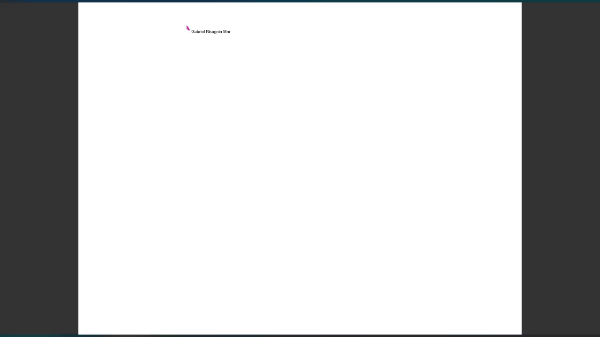

# Projeto: Lousa Colaborativa

Acesso: [https://elc1090.github.io/project4-2025a-gabriel-1/](https://elc1090.github.io/project4-2025a-gabriel-1/)

### Desenvolvedor
Gabriel Bisognin Moro | Ciência da Computação

### Descrição do produto

Aplicação web de desenho compartilhado em tempo real, permite que múltiplos usuários desenhem simultaneamente em um canvas digital, visualizando as contribuições uns dos outros instantaneamente. Cada usuário pode gerenciar suas próprias lousas, criar novas, deletá-las e compartilhar o acesso com outros.

Funcionalidades principais incluem:

  - Múltiplas Lousas: Usuários logados pelo Google podem criar, deletar e alternar entre diferentes lousas. Cada lousa é um espaço de desenho independente.   
  - Compartilhamento de Lousa: O dono de uma lousa pode compartilhar o acesso com outros usuários através de seus IDs únicos.   
   

  - Login Flexível: Autenticação com conta Google ou acesso rápido como visitante.   
  - Telas de desenho interativas com capacidade de arrastar (pan) e aplicar zoom, acessível tanto por mouse quanto por gestos de toque (um dedo para desenhar, dois dedos para zoom/pan).  
  - Ferramentas de desenho: Seleção de cor (através de uma paleta), espessura do pincel, borracha, capacidade de desfazer e refazer e formas geométricas.   
   

  - Menu de Contexto: Um menu acessível com o botão direito (ou toque longo em telas de toque) oferece atalhos para limpar o canvas e resetar a visualização.    
  - Persistência dos desenhos, que são salvos no banco de dados e recarregados quando um usuário acessa ou atualiza a página.    
  - Identificação de Usuário: O ID do usuário fica visível e pode ser copiado facilmente para agilizar o compartilhamento.    

### Desenvolvimento

Configuração inicial do projeto (Vue.js para frontend, Flask/Python para backend) e o setup para deploy no GitHub Pages e Render.  
Progressivamente, implementei  a interface de desenho no frontend, evoluindo de um canvas básico para uma versão com funcionalidades de arrastar (pan), zoom, e um menu de contexto customizado, adaptando-a para interações de mouse e toque (incluindo toque longo e gestos de pinça).
No backend, configurei SQLAlchemy com PostgreSQL para persistência de dados e o Flask-SocketIO (utilizando gevent após depurar questões com eventlet) para a comunicação em tempo real, essencial para a colaboração.  
Houve etapas significativas de depuração e refinamento, especialmente para:  
- Corrigir configurações de deploy no Render (Gunicorn, workers assíncronos, variáveis de ambiente).  
- Resolver problemas de CORS entre o frontend e o backend.  
- Garantir que as migrações do banco de dados funcionassem corretamente em um ambiente PostgreSQL novo.  
- Assegurar que as interações de toque fossem funcionais em dispositivos móveis.  
- Implementar o carregamento do estado do desenho ao conectar/recarregar a página.  

#### Tecnologias
**Frontend:**
- [Vue.js](https://vuejs.org/)
- [Vite](https://vitejs.dev/)
- [Socket.IO Client](https://socket.io/docs/v4/client-api/)

**Backend:**
- [Flask](https://flask.palletsprojects.com/)
- [Flask-SocketIO](https://flask-socketio.readthedocs.io/)
- [SQLAlchemy](https://www.sqlalchemy.org/)
- [Flask-SQLAlchemy](https://flask-sqlalchemy.palletsprojects.com/)
- [Flask-Migrate](https://flask-migrate.readthedocs.io/)
- [psycopg2](https://www.psycopg.org/)
- [Gunicorn](https://gunicorn.org/)
- [gevent](http://www.gevent.org/)

**Base de Dados:**
- [PostgreSQL](https://www.postgresql.org/)

**Plataformas de Hospedagem:**
- [GitHub Pages](https://pages.github.com/)
- [Render](https://render.com/)

#### Ambiente de desenvolvimento

- [Vscode](https://code.visualstudio.com/)   
- [VScode Live Preview](https://marketplace.visualstudio.com/items?itemName=ms-vscode.live-server)   
- [Cursor](https://www.cursor.com/)

#### Referências e créditos

- [Flask-SocketIO](https://flask-socketio.readthedocs.io/): Extensão Flask para adicionar suporte a WebSockets usando Socket.IO
- [gevent](http://www.gevent.org/): Um framework de rede baseado em corrotinas para Python (usado como worker do Gunicorn para Socket.IO)
- [Flask-Migrate](https://flask-migrate.readthedocs.io/): Extensão Flask para lidar com migrações de banco de dados SQLAlchemy 
- [Gemini](https://gemini.google.com/) criação de códigos repetitivos, ajuda com novas técnologias, debug e otimização.

Projeto entregue para a disciplina de [Desenvolvimento de Software para a Web](http://github.com/andreainfufsm/elc1090-2025a) em 2025a
